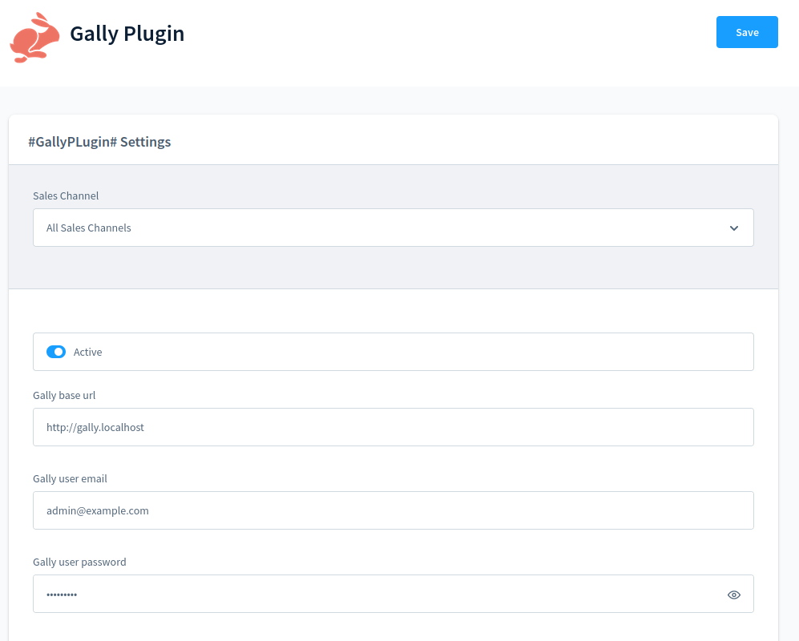

# Gally Plugin

## Dev env 



- Get the traefik proxy and run it : https://git.smile.fr/docker/traefik
- On gally, checkout `feat-shopware-connector` (this will disable varnish and add alias to get gally from https://gally.localhost)
- Init shopwhare in the gally project in a `shopware` directory
  https://redmine-projets.smile.fr/projects/gally-build/wiki/Shopware
- Clone this project in `gally/shopware/src/custom/plugins/GallyPlugin`
- Shopware should be available from http://shopware.localhost:1234/
- You might need to increase magento max nesting field to `200` :
`api/packages/gally-standard/src/Index/Helper/IndexSettings.php:158`
```php
  'mapping.total_fields.limit' => self::TOTAL_FIELD_LIMIT,
+ 'mapping.nested_fields.limit' => 200
```

## Usage

- From the shopware bo, configure active and configure gally plugin
- Run
    ```shell
    docker composer exec shopware bash            # Connect to the shopware container
    bin/console --no-debug gally:structure:sync   # Sync catalog et source field data with gally
    bin/console --no-debug gally:index            # Index category and product entity to gally
    ```
- You should be able to see your product and source field from gally backend

## Todo

- [x] Synchronize catalogs 
- [x] Synchronize metadata 
- [x] Synchronize basic source field
- [X] Sync source field label & options
  - [ ] Index source field property label by locale
- [X] Index category
- [ ] Index product
  - [ ] Index media
- [ ] Synchronize source field search conf
- [ ] Search product
  - Bug pagination 
- [ ] Index product custom field
- [ ] Build facet from ES response
- [ ] Index manufacturer
- [ ] Sync entity on post persist/update
- [ ] Index entity on post persist/update
- [ ] fetchAll entity perf ?
- [ ] Unit test

## Todo gally

- [x] Bulk rest category (https://github.com/Elastic-Suite/gally-standard/pull/37)
