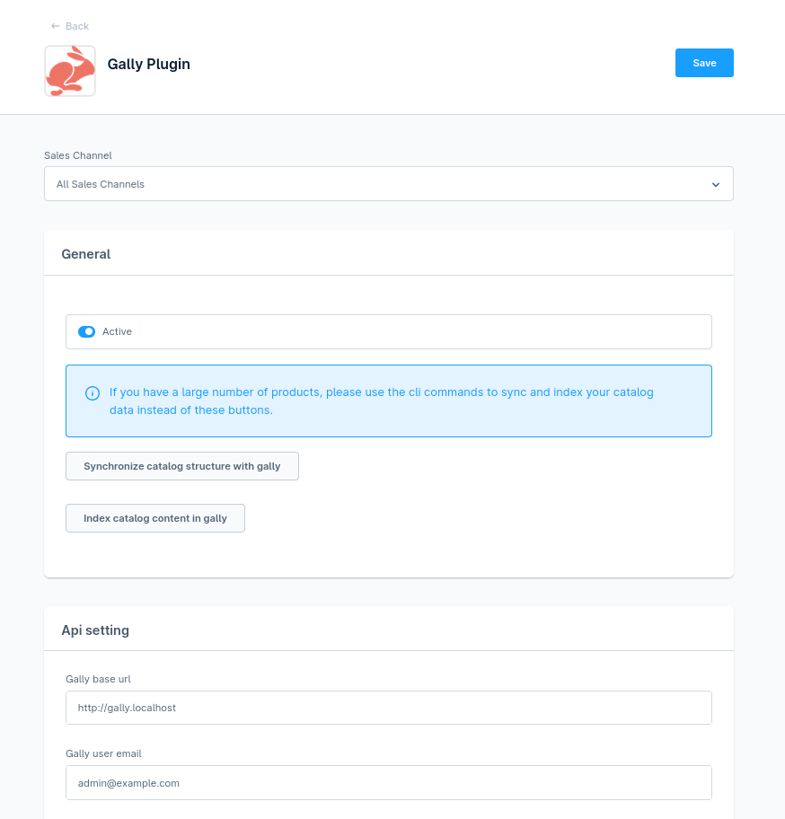

# Gally Plugin for Shopware

## :warning: Work In Progress

This plugin is a work-in-progress, you can check what it does below in the Todo section. It's not suitable actually for production usage, so use it at your own risks.

Of course, any contribution is welcome.

## Dev env 



- Get the traefik proxy and run it : https://git.smile.fr/docker/traefik
- On gally, checkout `feat-shopware-connector` (this will disable varnish and add alias to get gally from https://gally.localhost)
- Init shopwhare in the gally project in a `shopware` directory
  https://redmine-projets.smile.fr/projects/gally-build/wiki/Shopware
- Clone this project in `gally/shopware/src/custom/plugins/GallyPlugin`
- Shopware should be available from http://shopware.localhost:1234/
- You might need to increase magento max nesting field to `200` :
`api/packages/gally-standard/src/Index/Helper/IndexSettings.php:158`
```php
  'mapping.total_fields.limit' => self::TOTAL_FIELD_LIMIT,
+ 'mapping.nested_fields.limit' => 200
```

## Usage

- From the shopware bo, configure active and configure gally plugin
- Run
    ```shell
    docker composer exec shopware bash            # Connect to the shopware container
    bin/console --no-debug gally:structure:sync   # Sync catalog et source field data with gally
    bin/console --no-debug gally:index            # Index category and product entity to gally
    ```
- You should be able to see your product and source field from gally backend

## Todo

- Structure
  - [x] Synchronize catalogs 
  - [x] Synchronize metadata 
  - [x] Synchronize basic source field
  - [X] Sync source field label & options
  - [X] ~~Synchronize source field search conf~~ (Manage on gally side)
  - [X] Sync entity on post persist/update
- Index data
  - [X] Index category
  - [X] Index product
  - [X] Index entity on post persist/update
  - [X] Index manufacturer
- Search
  - [ ] Search product
    - [x] Full text search 
    - [x] Sort result with gally
    - [x] Filter result with gally
    - [x] Get facet from gally 
    - [x] Get sorting from gally
    - [x] aggregation free shipping
    - [X] aggregation manufacturer
    - [X] aggregation category
    - [ ] aggregation render swatches
    - [ ] category visbility
- [ ] Autocomplete
- [ ] Unit test
- [ ] fetchAll entity on each sync may create perf issue ?

## Todo gally

- [x] Bulk rest category (https://github.com/Elastic-Suite/gally-standard/pull/37)
- [X] Set product id as string 
